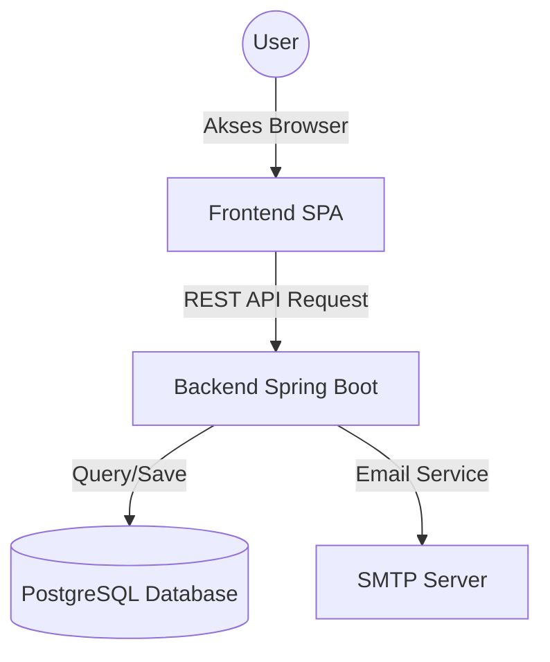
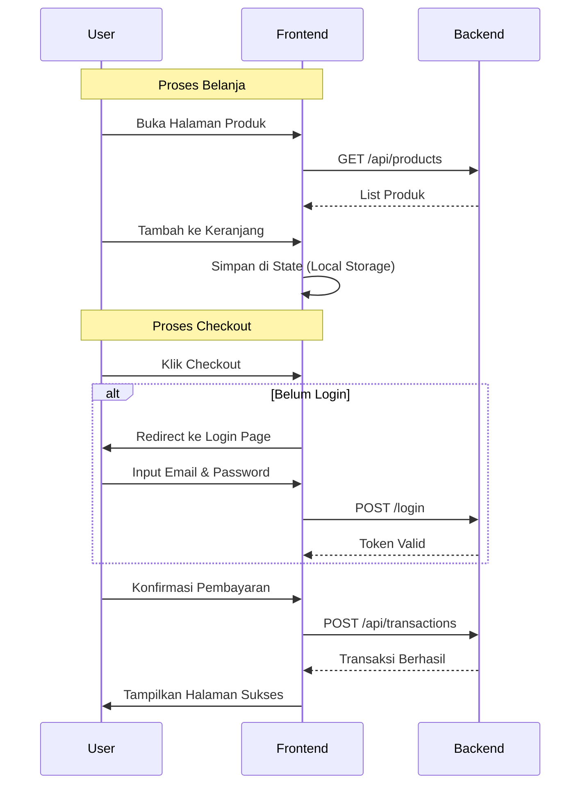

# 🧺 Fullstack Laundry Application

Aplikasi manajemen laundry berbasis web dengan arsitektur **Monorepo** yang memisahkan Backend (Spring Boot) dan Frontend (Vanilla JS SPA).

---

## 🏗️ Arsitektur Sistem

Aplikasi ini terdiri dari dua bagian utama yang berkomunikasi melalui REST API.



---

## 📂 Struktur Folder Terbaru

Untuk memudahkan pengembangan dan pemeliharaan, struktur folder frontend telah dikelompokkan berdasarkan **Fitur**. Developer tidak perlu lagi bingung mencari file; cukup buka folder sesuai fitur yang ingin diedit.

### 1. Frontend (`/frontend`)

```text
frontend/
├── app/
│   ├── core/               # Logika Inti Aplikasi
│   │   ├── router.js       # Pengatur navigasi halaman
│   │   └── state.js        # Penyimpan data sementara (User, Cart)
│   │
│   ├── pages/              # Halaman-halaman (Dikelompokkan per Fitur)
│   │   ├── auth/           # Fitur Autentikasi
│   │   │   ├── login.js
│   │   │   ├── register.js
│   │   │   └── ...
│   │   │
│   │   ├── home/           # Halaman Utama
│   │   │   └── index.js
│   │   │
│   │   ├── products/       # Fitur Produk
│   │   │   ├── list.js     # Daftar produk
│   │   │   └── detail.js   # Detail produk
│   │   │
│   │   ├── cart/           # Fitur Keranjang
│   │   │   └── index.js
│   │   │
│   │   ├── checkout/       # Fitur Pembayaran
│   │   │   └── index.js
│   │   │
│   │   └── orders/         # Fitur Riwayat Pesanan
│   │       ├── list.js
│   │       └── detail.js
│   │
│   └── utils/              # Fungsi bantuan (Validasi, Format uang, dll)
│       └── validator.js
│
├── js/
│   └── api.js              # Penghubung ke Backend (Fetch API Wrapper)
│
└── index.html              # File utama yang memuat aplikasi
```

### 2. Backend (`/backend`)

Backend dibangun menggunakan Java Spring Boot dengan struktur Layered Architecture:

```text
backend/src/main/java/com/laundry/BE_Laundry/
├── Controller/             # Menangani request HTTP dari Frontend
│   ├── AuthController.java
│   ├── CustomerController.java
│   ├── ProductController.java
│   └── TransactionController.java
│
├── Service/                # Logika bisnis
├── Repository/             # Akses ke Database
└── Model/                  # Definisi struktur data (Entity)
```

---

## 🔄 Alur Pengguna (User Flow)

Berikut adalah diagram alur bagaimana pengguna berinteraksi dengan aplikasi:



---

## 📸 Galeri Tampilan (Screenshot)

> **Untuk Developer/User:** Silakan ganti gambar placeholder di bawah ini dengan screenshot aplikasi yang sebenarnya. Simpan gambar Anda di folder `docs/images/` atau upload ke image host.

### 1. Halaman Login
*(Tempel screenshot halaman login di sini)*


### 2. Daftar Produk
*(Tempel screenshot halaman daftar produk di sini)*


### 3. Keranjang & Checkout
*(Tempel screenshot halaman keranjang di sini)*


---

## 💡 Penjelasan Teknis Khusus

### Apa itu `?v=fix8` pada tag Script?

Anda mungkin melihat kode seperti ini di `index.html`:
```html
<script src="./js/api.js?v=fix8"></script>
```

**Fungsinya:**
Ini adalah teknik **Cache Busting**. Browser biasanya menyimpan file JavaScript di "cache" (memori sementara) agar website loading lebih cepat. Namun, saat kita mengupdate kode, browser kadang masih memuat file lama yang tersimpan di cache.

Dengan menambahkan parameter unik seperti `?v=fix8` (Version Fix 8), kita "menipu" browser agar menganggap ini adalah file baru yang berbeda, sehingga browser dipaksa mendownload versi terbaru dari server. Ini memastikan user selalu mendapatkan perbaikan bug terbaru tanpa harus menghapus cache browser mereka secara manual.

---

## 🚀 Cara Menjalankan Aplikasi

### 1. Menjalankan Backend & Frontend (Docker)
Pastikan Docker Desktop sudah menyala.
```bash
docker compose up -d --build
```
- Backend akan berjalan di: `http://localhost:8081`
- Frontend akan berjalan di: `http://localhost:3000`

### 2. Menjalankan Frontend Manual (Opsional)
Jika tidak menggunakan container frontend:
```bash
# Dari folder root proyek
npx http-server ./frontend -p 5500 -c-1
```
Buka browser di: `http://localhost:5500`

