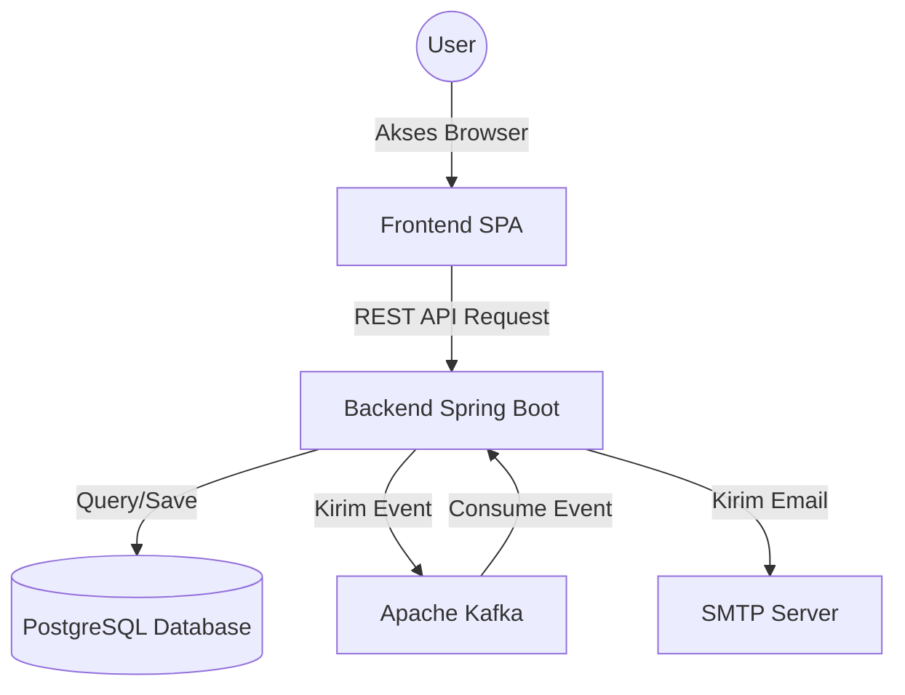
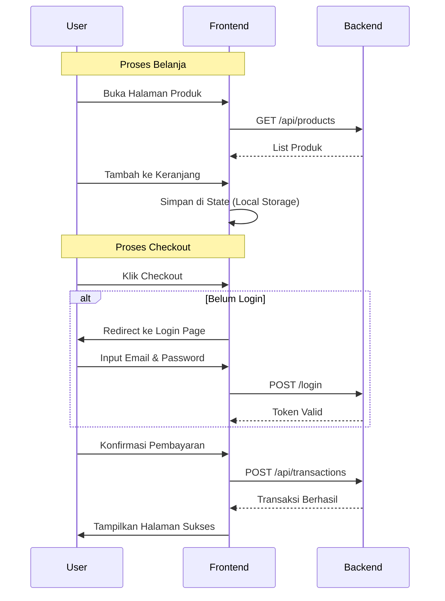

# 🧺 Fullstack Laundry Application

Aplikasi manajemen laundry / ecommerce sederhana dengan arsitektur **Monorepo** yang memisahkan Backend (Spring Boot) dan Frontend (React JS), dilengkapi dengan **Apache Kafka** untuk asynchronous processing!

## ✨ Ringkasan Singkat

- Frontend SPA berbasis **React JS + Vite**, di-serve lewat Nginx (Docker).
- Backend Spring Boot dengan PostgreSQL, OTP email, dan migrasi Flyway.
- **Apache Kafka** untuk asynchronous email processing dan event-driven architecture.
- Fitur:
  - Autentikasi (register, login, lupa/reset password) dengan OTP via email.
  - Katalog produk yang terhubung ke **toko** tertentu.
  - Keranjang & checkout dengan metode pembayaran COD / Transfer / Kartu Kredit (simulasi).
  - Halaman pesanan untuk user dan halaman **Pesanan Masuk (Toko)** untuk admin/pemilik.
  - Manajemen toko & produk (edit harga, deskripsi, dll.) dari UI.

---

## 🏗️ Arsitektur Sistem

Aplikasi ini terdiri dari beberapa layanan yang saling berkomunikasi:


```mermaid
graph TD
    User((User)) -->|Akses Browser| FE[Frontend SPA]
    FE -->|REST API Request| BE[Backend Spring Boot]
    BE -->|Query/Save| DB[(PostgreSQL Database)]
    BE -->|Kirim Event| K[Apache Kafka]
    K -->|Consume Event| BE[Backend Spring Boot]
    BE -->|Kirim Email| SMTP[SMTP Server]
```

### Bagaimana Kafka Bekerja di Aplikasi Ini?
Kafka digunakan untuk **memisahkan proses pengiriman email** dari request utama user. Ketika user request OTP atau register:
1. Backend mengirim event ke Kafka topic `laundry-email-events`
2. User langsung mendapatkan response "OTP dikirim" tanpa menunggu email selesai
3. Consumer di backend mengambil event dari Kafka dan mengirim email secara asynchronous

---

---

## 📂 Struktur Folder Terbaru

Untuk memudahkan pengembangan dan pemeliharaan, struktur folder frontend telah dikelompokkan berdasarkan **Fitur**. Developer tidak perlu lagi bingung mencari file; cukup buka folder sesuai fitur yang ingin diedit.

### 1. Frontend (`/frontend`)

```text
frontend/
├── app/
│   ├── core/               # Logika Inti Aplikasi
│   │   ├── router.js       # Pengatur navigasi halaman
│   │   └── state.js        # Penyimpan data sementara (User, Cart)
│   │
│   ├── pages/              # Halaman-halaman (Dikelompokkan per Fitur)
│   │   ├── auth/           # Fitur Autentikasi
│   │   │   ├── login.js
│   │   │   ├── register.js
│   │   │   └── ...
│   │   │
│   │   ├── home/           # Halaman Utama
│   │   │   └── index.js
│   │   │
│   │   ├── products/       # Fitur Produk
│   │   │   ├── list.js     # Daftar produk
│   │   │   └── detail.js   # Detail produk
│   │   │
│   │   ├── cart/           # Fitur Keranjang
│   │   │   └── index.js
│   │   │
│   │   ├── checkout/       # Fitur Pembayaran
│   │   │   └── index.js
│   │   │
│   │   └── orders/         # Fitur Riwayat Pesanan
│   │       ├── list.js
│   │       └── detail.js
│   │
│   └── utils/              # Fungsi bantuan (Validasi, Format uang, dll)
│       └── validator.js
│
├── js/
│   └── api.js              # Penghubung ke Backend (Fetch API Wrapper)
│
└── index.html              # File utama yang memuat aplikasi
```

### 2. Backend (`/backend`)

Backend dibangun menggunakan Java Spring Boot dengan struktur Layered Architecture:

```text
backend/src/main/java/com/laundry/BE_Laundry/
├── Config/                 # Konfigurasi aplikasi (Security, CORS, WebAccess)
├── Controller/             # Menangani request HTTP dari Frontend
│   ├── AuthController.java
│   ├── CustomerController.java
│   ├── OTPController.java
│   ├── ProductController.java
│   └── TransactionController.java
│
├── Service/                # Logika bisnis
│   ├── EmailService.java
│   ├── KafkaProducerService.java    # Producer untuk kirim event ke Kafka
│   ├── KafkaConsumerService.java    # Consumer untuk terima event dari Kafka
│   └── ...
│
├── DTO/                    # Data Transfer Object (request/response payload)
│   └── EmailEventDTO.java  # DTO untuk event email di Kafka
│
├── Repository/             # Akses ke Database
└── Model/                  # Definisi struktur data (Entity)
```

---

## 🔄 Alur Pengguna (User Flow)

Berikut adalah diagram alur bagaimana pengguna berinteraksi dengan aplikasi:


```mermaid
sequenceDiagram
    participant U as User
    participant F as Frontend
    participant B as Backend
    
    Note over U, F: Proses Belanja
    U->>F: Buka Halaman Produk
    F->>B: GET /api/products
    B-->>F: List Produk
    U->>F: Tambah ke Keranjang
    F->>F: Simpan di State (Local Storage)
    
    Note over U, F: Proses Checkout
    U->>F: Klik Checkout
    alt Belum Login
        F->>U: Redirect ke Login Page
        U->>F: Input Email & Password
        F->>B: POST /login
        B-->>F: Token Valid
    end
    
    U->>F: Konfirmasi Pembayaran
    F->>B: POST /api/transactions
    B-->>F: Transaksi Berhasil
    F->>U: Tampilkan Halaman Sukses
```

---

## 💡 Penjelasan Teknis Khusus

### Apa itu `?v=fix8` pada tag Script?

Anda mungkin melihat kode seperti ini di `index.html`:
```html
<script src="./js/api.js?v=fix8"></script>
```

**Fungsinya:**
Ini adalah teknik **Cache Busting**. Browser biasanya menyimpan file JavaScript di "cache" (memori sementara) agar website loading lebih cepat. Namun, saat kita mengupdate kode, browser kadang masih memuat file lama yang tersimpan di cache.

Dengan menambahkan parameter unik seperti `?v=fix8` (Version Fix 8), kita "menipu" browser agar menganggap ini adalah file baru yang berbeda, sehingga browser dipaksa mendownload versi terbaru dari server. Ini memastikan user selalu mendapatkan perbaikan bug terbaru tanpa harus menghapus cache browser mereka secara manual.

---

## 🚀 Cara Menjalankan Aplikasi

### Prasyarat
Pastikan Anda memiliki:
- **Docker Desktop** (untuk Windows/macOS) atau **Docker Engine** (untuk Linux)
- **Git** (opsional, untuk clone repository)

### 1. Menjalankan Semua Layanan (Docker)
Pastikan Docker Desktop sudah menyala!

1. Clone repository (jika belum):
   ```bash
   git clone <repository-url>
   cd Fullstack-Laundry
   ```

2. Buat file `.env` di root project (contoh di bagian Environment).

3. Jalankan semua layanan:
   ```bash
   docker compose up -d --build
   ```

Tunggu beberapa saat sampai semua container berjalan!

### Akses Aplikasi
- **Frontend**: `http://localhost:3000`
- **Backend API**: `http://localhost:8081`
- **PostgreSQL**: `localhost:5433` (untuk manajemen database)
- **Kafka**: `localhost:29092` (untuk akses dari luar Docker)

### 2. Melihat Log Aplikasi
Untuk melihat log dan memastikan Kafka berjalan dengan baik:
```bash
# Melihat log semua container
docker compose logs -f

# Melihat log backend saja
docker compose logs -f app

# Melihat log Kafka saja
docker compose logs -f kafka
```

### 3. Menghentikan Aplikasi
```bash
docker compose down

# Untuk menghapus volume database juga (hati-hati!)
docker compose down -v
```

### 4. Menjalankan Frontend Secara Lokal (Opsional)
Jika ingin menjalankan frontend secara lokal untuk development:
```bash
# Dari folder frontend
cd frontend
npm install
npm run dev
```
Buka browser di: `http://localhost:3000`

---

## 🛠️ Tech Stack

Aplikasi ini dibangun dengan teknologi berikut:

### Backend
- **Java 21** - Bahasa pemrograman
- **Spring Boot 3.3.13** - Framework backend
  - Spring Data JPA - ORM untuk akses database
  - Spring Security - Keamanan aplikasi (JWT)
  - Spring Kafka - Integrasi dengan Apache Kafka
  - Spring Mail - Pengiriman email
- **PostgreSQL 16** - Database relational
- **Maven** - Build tools dan manajemen dependensi
- **Lombok** - Mengurangi boilerplate code
- **Flyway** - Database migration (opsional, dinonaktifkan)
- **Apache Kafka** - Message broker untuk asynchronous processing
- **Zookeeper** - Manajemen cluster Kafka

### Frontend
- **React 18** - Library untuk UI
- **Vite** - Build tool & dev server
- **React Router Dom** - Routing
- **Axios** - HTTP Client
- **Nginx** - Web server untuk serve production build

### DevOps
- **Docker** - Containerization
- **Docker Compose** - Orkestrasi multi-container

---

## ⚙️ Environment (Docker Compose)

`docker-compose.yml` dan backend membaca konfigurasi dari environment berikut:

### Database
- `DB_NAME` - Nama database
- `DB_USERNAME` - Username database
- `DB_PASSWORD` - Password database
- `DB_URL` - JDBC URL database (misalnya `jdbc:postgresql://db:5432/laundrydb`)

### Email
Untuk mengirim email via SMTP (contoh Gmail):
- `SPRING_MAIL_HOST` - Host SMTP (misalnya `smtp.gmail.com`)
- `SPRING_MAIL_PORT` - Port SMTP (misalnya `587`)
- `SPRING_MAIL_USERNAME` - Alamat email pengirim
- `SPRING_MAIL_PASSWORD` - App Password email (untuk Gmail, gunakan App Password, bukan password utama)

### Kafka
- `SPRING_KAFKA_BOOTSTRAP_SERVERS` - Alamat Kafka broker (default: `kafka:9092` untuk Docker, `localhost:29092` untuk local)

Contoh `.env` sederhana:

```env
# Database Configuration
DB_NAME=db-laundry
DB_USERNAME=subrutin
DB_PASSWORD=subrutin
DB_URL=jdbc:postgresql://db:5432/db-laundry

# Email Configuration (Gmail example)
SPRING_MAIL_HOST=smtp.gmail.com
SPRING_MAIL_PORT=587
SPRING_MAIL_USERNAME=your-email@gmail.com
SPRING_MAIL_PASSWORD=your-app-password

# Kafka Configuration (optional, default sudah ada di docker-compose.yml)
SPRING_KAFKA_BOOTSTRAP_SERVERS=kafka:9092
```

File `.env` **tidak** di-commit ke Git sehingga setiap environment (local, staging, production) bisa punya konfigurasi sendiri.
